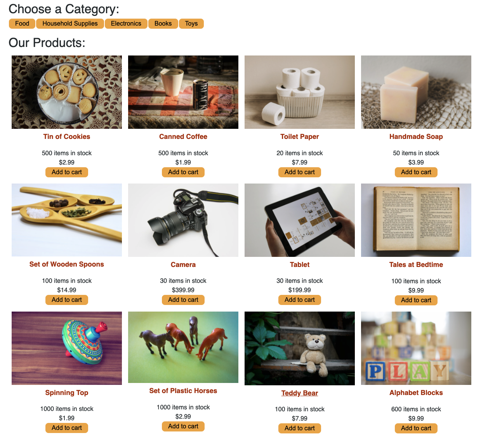
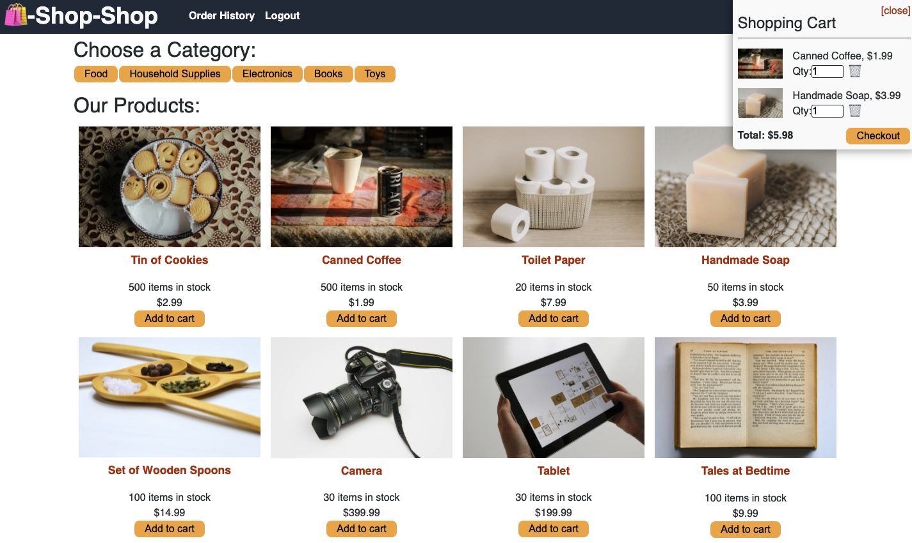

# Redux Store 
## About
On this website, you are able to scroll through products and add them to your cart and checkout, as you would on an actual e-commerce website. Using `graphql` and `MongoDB` this website stores your products in a database, and uses different queries and mutations for website functionality.

## Table of Contents
* [Description](#description)
* [Installation](#installation)
* [Usage](#usage)
* [Contributing](#contributing)
* [Tests](#tests)
* [License](#license)
* [Questions](#questions)

## Description
Upon entering the site, you are able to view a variety of products as well and add them to your cart. However, you cannot checkout without first logging in or signing up. 

Once you have logged in, you can view the cart with the option to checkout, which takes you to a Stripe checkout page.

## Installation
Run `npm i` to install `apollo-server-express`, `bcrypt`, `express`, `graphql`, `jsonwebtoken`, `mongoose`, `stripe` for server-side, and `@apollo/client`, `@stripe/stripe-js`, `@testing-library/jest-dom`, `@testing-library/react`, `@testing-library/user-event`, `graphql`, `jwt-decode`, `react`, `react-dom`, `react-redux`, `react-router-dom`, `react-scripts`, `redux` for client-side.

## Usage

## Contributing

## Tests
To run client-side tests, run `npm run test` in the client folder.

## License
This project is licensed under MIT.

## Questions
Here is a link to my [GitHub](https://github.com/kelliekumasaka) or shoot me an [email](mailto:kelliek3@gmail.com).
